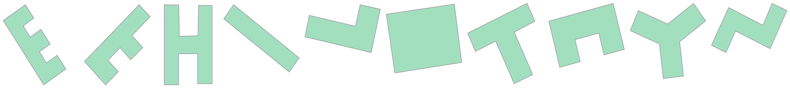
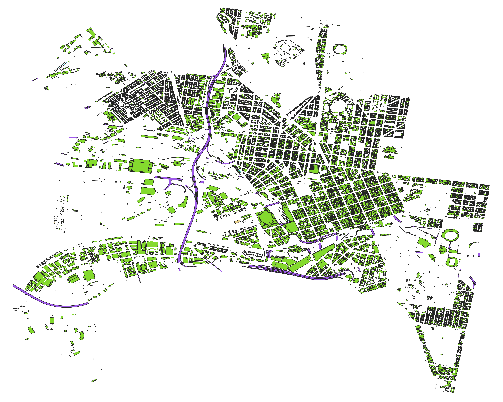
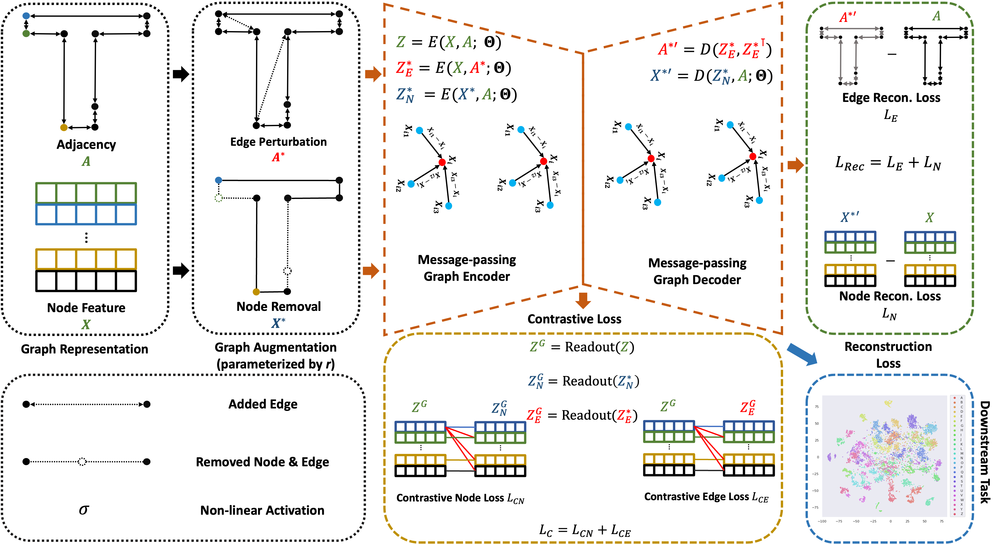

# Contrastive Graph Autoencoder for Geometric Polygon Retrieval from Building Datasets

## Abstract

Retrieval of polygon geometries with similar shapes from maps is a challenging geographic information task. Existing approaches can not process geometry polygons with complex shapes, (multiple) holes and are sensitive to geometric transformations (e.g., rotation and reflection). We propose Contrastive Graph Autoencoder (CGAE), a robust and effective graph representation autoencoder for extracting polygon geometries of similar shapes from real-world building maps based on template queries. By leveraging graph message-passing layers, graph feature augmentation and contrastive learning, the proposed CGAE reconstructs graph features of w.r.t input graph representations of polygons, outperforming existing graph-based autoencoders (GAEs) on geometry retrieval of similar polygons. Experimentally, we demonstrate this capability based on template query shapes on real-world datasets and show its high robustness to geometrical transformations in contrast to existing GAEs, indicating the strong generalizability and versatility of CGAE, incl. on complex real-world building footprints.

## Dataset(s)

Glyph Polygons


[OSM Buildings](http://doi.org/10.6084/m9.figshare.11742507)



[Melbourne Footprints](https://data.melbourne.vic.gov.au/explore/dataset/2020-building-footprints/table/)


## CGAE



Model architecture of CGAE. Inputs: vertex coordinates of polygon geometries are encoded into a node feature matrix $X$, and the connectivity of vertices into the adjacency matrix $A$. We produce contrastive pairs of $X$ and $A$ by graph augmentations, obtaining a removed node feature matrix $X^\ast$ and a perturbed adjacency matrix, $A^\ast$. CGAE learns robust and discriminative latent embeddings by the computation of the graph reconstruction loss $\mathcal{L}_{Rec}$ and contrastive loss $\mathcal{L}_{C}$. Best viewed in color.

## Experiment

The proposed CGAE are trained and evaluated by default on dataset Glyph Polygons via

```python
python trainval.py
```

To train and evaluated the baseline GAE, change ```aug: True``` to ```aug: False``` in ```cfg/gae.yaml```.

Experiment results are implemented and demonstratd in ```exp/...```, where the quantitative results of models evaluated on the three polygon datasets can be found in ```exp/eval.ipynb```; and the qualitative retuls of models can be found in ```exp/retrieval_cgae.ipynb``` and ```exp/retrieval_gae.ipynb```.
