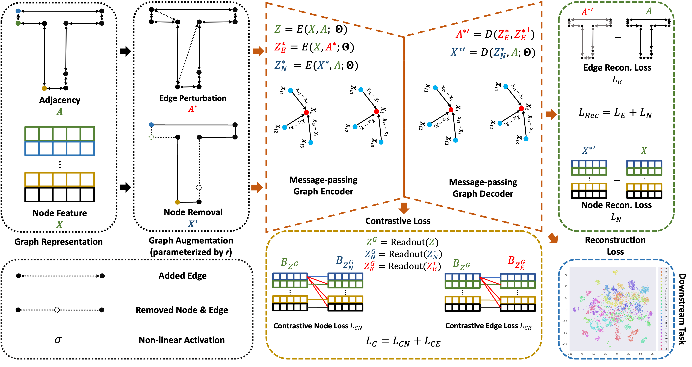

# Contrastive Graph Autoencoder for Shape-based Polygon Retrieval from Large Geometry Datasets

## Abstract

Retrieval of polygon geometries with similar shapes from maps is a challenging geographic information task. Existing approaches can not process geometry polygons with complex shapes, (multiple) holes and are sensitive to geometric transformations (e.g., rotation). We propose Contrastive Graph Autoencoder (CGAE), a robust and effective graph representation autoencoder for extracting polygon geometries of similar shapes from real-world building maps based on template queries. By leveraging graph message-passing layers, graph feature augmentation and contrastive learning, the proposed CGAE embeds highly discriminative latent embeddings by reconstructing graph features w.r.t. the graph representations of input polygons, outperforming existing graph-based autoencoders (GAEs) in geometry retrieval of similar polygons. Experimentally, we demonstrate this capability based on template query shapes on real-world datasets and show its high robustness to geometric transformations in contrast to existing GAEs, indicating the strong generalizability and versatility of CGAE, including on complex real-world building footprints.

## Dataset(s)

(Synthetic) Glyph Polygons


[(Controlled) OSM Buildings](http://doi.org/10.6084/m9.figshare.11742507)


[(Uncontrolled) Melbourne Footprints](https://data.melbourne.vic.gov.au/explore/dataset/2020-building-footprints/table/)


## CGAE



Model architecture of CGAE. Inputs: vertex coordinates of polygon geometries are encoded into a node feature matrix $X$, and the connectivity of vertices into the adjacency matrix $A$. We produce contrastive pairs of $X$ and $A$ by graph augmentations, obtaining a removed node feature matrix $X^\ast$ and a perturbed adjacency matrix, $A^\ast$. CGAE learns robust and discriminative latent embeddings by the computation of the graph reconstruction loss $\mathcal{L}_{Rec}$ and contrastive loss $\mathcal{L}_{C}$. Best viewed in color.

## Experiment

The proposed CGAE are trained and evaluated by default on dataset Glyph Polygons via

```python
python trainval_gae.py
```

To train and evaluate the baseline GAE, change ```aug: True``` to ```aug: False``` in ```cfg/gae.yaml```.

Experiment results are implemented and demonstrated in ```exp/...```, where the quantitative results of models evaluated on the three polygon datasets can be found in ```exp/eval.ipynb```; and the qualitative retuls of models can be found in ```exp/retrieval_cgae.ipynb``` and ```exp/retrieval_gae.ipynb```.

## Update

We have added new ML-based benchmark [NUFT](https://github.com/gengchenmai/polygon_encoder) from **Mai et al.**, which is based on [DDSL](https://github.com/maxjiang93/DDSL) from **Jiang et al.** to the experiments of CGAE. Additionally, to train and evlaute [NUFT](https://github.com/gengchenmai/polygon_encoder), run

```python
python trainval_nuft.py
```

Quantitative results of [NUFT](https://github.com/gengchenmai/polygon_encoder) is recorded in ```exp/eval_nuft.ipynb```, which are tested on Glyph, OSM and Melbourne datasets. Polygon retrieval \(qualitative\) results of [NUFT](https://github.com/gengchenmai/polygon_encoder) are shown in ```exp/retrieval_nuft.ipynb```.

Additionally, we have added non ML-based benchmarks: [Turning Function](https://pypi.org/project/turning-function/) and [Procrustes](https://docs.scipy.org/doc/scipy/reference/generated/scipy.spatial.procrustes.html) to experiments as reference. Qualitative results of methods are shown in  ```exp/retrieval_turning.ipynb``` and  ```exp/retrieval_procrustes.ipynb```, respectively.

### Reference

```text
@article{mai2023towards,
  title={Towards general-purpose representation learning of polygonal geometries},
  author={Mai, Gengchen and Jiang, Chiyu and Sun, Weiwei and Zhu, Rui and Xuan, Yao and Cai, Ling and Janowicz, Krzysztof and Ermon, Stefano and Lao, Ni},
  journal={GeoInformatica},
  volume={27},
  number={2},
  pages={289--340},
  year={2023},
  publisher={Springer}
}

@InProceedings{Jiang_2019_ICCV,
author = {Jiang, Chiyu "Max" and Lansigan, Dana and Marcus, Philip and Niessner, Matthias},
title = {DDSL: Deep Differentiable Simplex Layer for Learning Geometric Signals},
booktitle = {The IEEE International Conference on Computer Vision (ICCV)},
month = {October},
year = {2019}
}

@inproceedings{jiang2018convolutional,
title={Convolutional Neural Networks on Non-uniform Geometrical Signals Using Euclidean Spectral Transformation},
author={Chiyu Max Jiang and Dequan Wang and Jingwei Huang and Philip Marcus and Matthias Niessner},
booktitle={International Conference on Learning Representations},
year={2019},
url={https://openreview.net/forum?id=B1G5ViAqFm},
}

@techreport{arkin1989efficiently,
  title={An efficiently computable metric for comparing polygonal shapes},
  author={Arkin, Esther M and Chew, L Paul and Huttenlocher, Daniel P and Kedem, Klara and Mitchell, Joseph SB},
  year={1989},
  institution={Cornell University Operations Research and Industrial Engineering}
}

@article{goodall1991procrustes,
  title={Procrustes methods in the statistical analysis of shape},
  author={Goodall, Colin},
  journal={Journal of the Royal Statistical Society: Series B (Methodological)},
  volume={53},
  number={2},
  pages={285--321},
  year={1991},
  publisher={Wiley Online Library}
}

```
